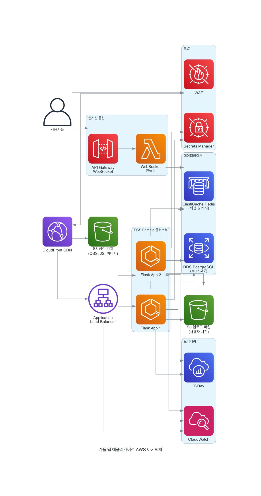

# 커플 웹 애플리케이션 AWS 아키텍처 제안

## 개요

현재 Flask 기반의 커플 웹 애플리케이션을 AWS 클라우드 환경으로 마이그레이션하기 위한 아키텍처를 제안합니다. 이 아키텍처는 확장성, 가용성, 보안성을 고려하여 설계되었습니다.

## 아키텍처 구성 요소

### 1. 프론트엔드 및 CDN
- **Amazon CloudFront**: 정적 자산(CSS, JS, 이미지) 캐싱 및 글로벌 배포
- **AWS WAF**: 웹 애플리케이션 방화벽으로 보안 위협 차단

### 2. 로드 밸런싱
- **Application Load Balancer (ALB)**: HTTP/HTTPS 트래픽 분산 및 SSL 종료
- 다중 가용 영역(Multi-AZ) 배포로 고가용성 보장

### 3. 컴퓨팅 계층
- **Amazon ECS with Fargate**: 서버리스 컨테이너 실행 환경
- Flask 애플리케이션을 Docker 컨테이너로 패키징
- 자동 스케일링으로 트래픽 변화에 대응

### 4. 데이터베이스
- **Amazon RDS PostgreSQL**: 관계형 데이터베이스 (Multi-AZ 배포)
- **Amazon ElastiCache Redis**: 세션 저장소 및 캐싱 레이어

### 5. 스토리지
- **Amazon S3**: 
  - 정적 파일 저장 (CSS, JS, 이미지)
  - 사용자 업로드 파일 저장 (사진, 메모리)

### 6. 실시간 통신
- **API Gateway WebSocket**: WebSocket 연결 관리
- **AWS Lambda**: WebSocket 메시지 처리 및 실시간 알림

### 7. 보안
- **AWS Secrets Manager**: 데이터베이스 자격증명 및 API 키 관리
- **AWS WAF**: 웹 애플리케이션 보안

### 8. 모니터링 및 로깅
- **Amazon CloudWatch**: 메트릭 수집 및 알람
- **AWS X-Ray**: 분산 추적 및 성능 분석

## 주요 기능별 아키텍처 매핑

### D-Day 관리
- ECS에서 실행되는 Flask 애플리케이션
- RDS PostgreSQL에 데이터 저장
- Redis 캐싱으로 성능 최적화

### 캘린더 & 일정
- 실시간 업데이트를 위한 WebSocket 연결
- Lambda 함수를 통한 이벤트 처리

### 랜덤 질문
- 일일 질문 생성 로직을 Lambda로 분리 가능
- CloudWatch Events로 스케줄링

### 메모리 북
- S3에 이미지 파일 저장
- CloudFront를 통한 이미지 배포

### 무드 트래커
- 실시간 무드 공유를 위한 WebSocket 활용
- 히스토리 데이터는 RDS에 저장

### 실시간 알림
- API Gateway WebSocket + Lambda 조합
- ElastiCache를 통한 세션 관리

## 비용 최적화 전략

### 1. 컴퓨팅 비용
- **Fargate Spot**: 개발/테스트 환경에서 최대 70% 비용 절감
- **Auto Scaling**: 트래픽에 따른 자동 스케일링으로 불필요한 리소스 제거

### 2. 스토리지 비용
- **S3 Intelligent Tiering**: 자동으로 적절한 스토리지 클래스 선택
- **CloudFront**: 오리진 서버 부하 감소

### 3. 데이터베이스 비용
- **RDS Reserved Instances**: 1년 약정으로 최대 60% 비용 절감
- **ElastiCache**: 데이터베이스 쿼리 부하 감소

## 보안 고려사항

### 1. 네트워크 보안
- VPC 내 프라이빗 서브넷에 애플리케이션 배치
- Security Group으로 포트 및 프로토콜 제한
- WAF로 웹 공격 차단

### 2. 데이터 보안
- RDS 암호화 (저장 시 및 전송 시)
- S3 버킷 암호화
- Secrets Manager로 자격증명 관리

### 3. 접근 제어
- IAM 역할 기반 접근 제어
- 최소 권한 원칙 적용

## 마이그레이션 단계

### Phase 1: 기본 인프라 구축
1. VPC 및 네트워크 설정
2. RDS PostgreSQL 인스턴스 생성
3. ElastiCache Redis 클러스터 생성
4. S3 버킷 생성 및 설정

### Phase 2: 애플리케이션 컨테이너화
1. Dockerfile 작성
2. ECR 리포지토리 생성
3. Docker 이미지 빌드 및 푸시

### Phase 3: ECS 서비스 배포
1. ECS 클러스터 생성
2. Task Definition 작성
3. ECS 서비스 배포
4. ALB 설정 및 연결

### Phase 4: 실시간 기능 구현
1. API Gateway WebSocket 설정
2. Lambda 함수 배포
3. WebSocket 연결 테스트

### Phase 5: 모니터링 및 최적화
1. CloudWatch 대시보드 구성
2. X-Ray 추적 설정
3. 성능 모니터링 및 튜닝

## 예상 월간 비용 (소규모 서비스 기준)

- **ECS Fargate**: $30-50 (2 vCPU, 4GB RAM)
- **RDS PostgreSQL**: $25-40 (db.t3.micro)
- **ElastiCache Redis**: $15-25 (cache.t3.micro)
- **ALB**: $20-25
- **S3**: $5-15 (100GB 저장)
- **CloudFront**: $5-10
- **기타 서비스**: $10-20

**총 예상 비용**: $110-185/월

## 다음 단계

1. AWS 계정 설정 및 IAM 사용자 생성
2. Terraform 또는 CloudFormation 템플릿 작성
3. CI/CD 파이프라인 구축 (CodePipeline + CodeBuild)
4. 단계별 마이그레이션 실행

이 아키텍처는 현재 애플리케이션의 기능을 유지하면서 클라우드의 장점을 최대한 활용할 수 있도록 설계되었습니다.